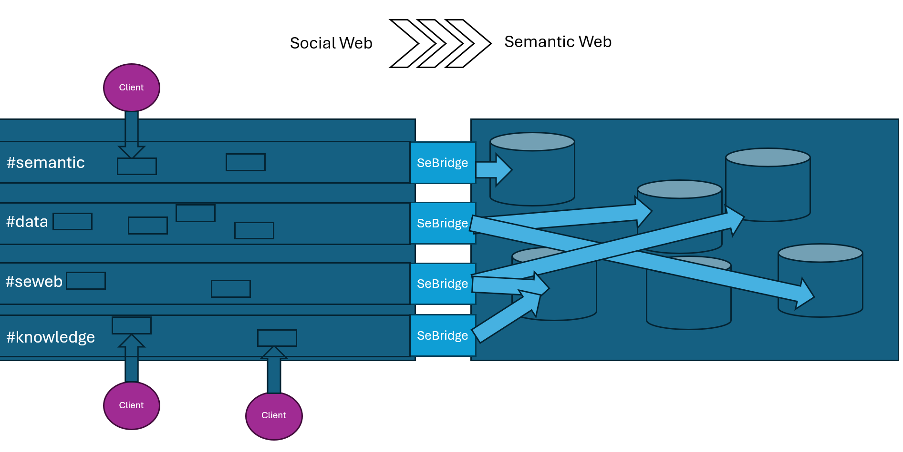
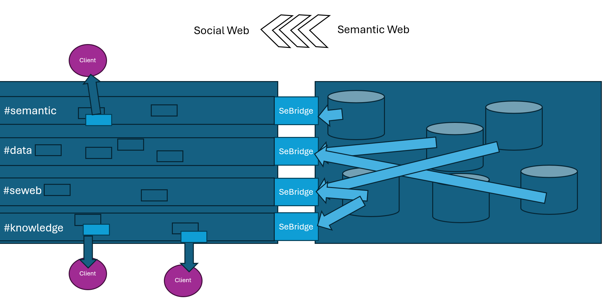

# Seamantic

Semantic-web-first Mastodon client - introduces a "semantic feed", with which you can communicate with knowledge bases.
You can send query to the semantic feed, which will hopefully be answered by by semantic bots (for example SeBridge).
To keep the semantic bots motivated, it is also recommended to occasionally insert data to the feed by posting insert-queries to it.
The client reminds you user of this with the "sea-level", which rises when the user queries data from the semantic feed and is lowered, when data is inserted.

In the following, the flow of data from the Seamantic-Clients to the semantic web is shown:

In the next image, SeBridges answer the queries that were send earlier to the semantic web.

This way, a stream of data between clients and knowledge bases is created, which builds on consensus and high quality of data.
